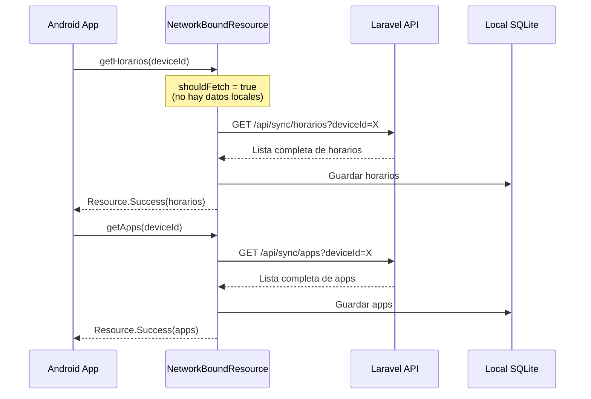
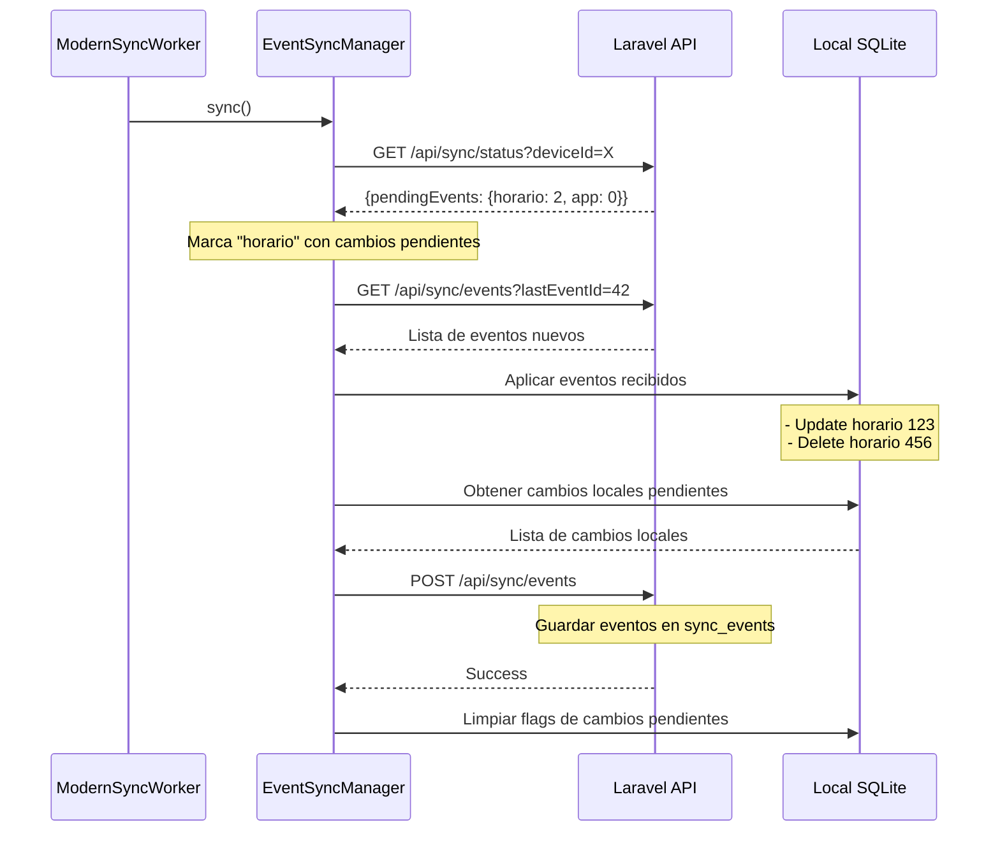

# 🛡️ Control Parental v2.0 - Sistema de Monitoreo Inteligente

[](https://laravel.com)
[](https://php.net)
[](https://tailwindcss.com)
[](https://docker.com)
[](https://aws.amazon.com)
[](https://letsencrypt.org)

Un sistema completo de control parental desarrollado con Laravel que permite a los padres monitorear y gestionar el uso de dispositivos móviles de sus hijos en **tiempo real** con actualización automática en todas las vistas.

## 🌐 **Aplicación en Vivo**
**URL de Producción**: [https://goooglee.online](https://goooglee.online)

- ✅ **HTTPS habilitado** con certificados SSL gratuitos (Let's Encrypt)
- ✅ **Despliegue automático** con CI/CD en cada push a main
- ✅ **Infraestructura AWS** escalable y segura
- ✅ **Zero Downtime** en despliegues

## ✨ Características Principales

### 🔄 **Sistema de Actualización Automática Completo**
- **Actualización en tiempo real** cada 3 segundos en todas las vistas principales
- **Detección inteligente de cambios** - Solo actualiza cuando hay modificaciones reales
- **Optimización de rendimiento** - Manejo inteligente de errores y timeouts
- **Indicadores visuales** de actualización sutiles y no intrusivos
- **Adaptación automática** a problemas de conectividad

#### **Vistas con Actualización Automática:**
| **Vista** | **Intervalo** | **Funcionalidad** |
|-----------|---------------|-------------------|
| **Lista de Dispositivos** | 3 segundos | Estado online/offline, contador |
| **Vista de Dispositivo** | 3 segundos | Estado del dispositivo, apps |
| **Lista de Horarios** | 3 segundos | Lista completa, crear/eliminar |
| **Editar Horario** | 3 segundos | Detectar cambios/eliminación |
| **Página de Inicio** | 3 segundos | Estadísticas en tiempo real |
| **Login/Registro** | 5 segundos | Estado del servidor |

### 📱 **Gestión de Dispositivos**
- **Vinculación de dispositivos** Android/iOS
- **Monitoreo de estado** online/offline en tiempo real
- **Información de batería** actualizada automáticamente
- **Historial de actividad** detallado
- **Sincronización automática** de datos

### 📱 **Control de Aplicaciones**
- **Lista de aplicaciones** instaladas con actualización automática
- **Iconos de aplicaciones** desde la base de datos (formato base64)
- **Configuración de permisos** por aplicación
- **Estadísticas de uso** detalladas
- **Guardado asíncrono** con AJAX

### ⏰ **Sistema de Horarios Inteligente**
- **Horarios personalizables** por dispositivo
- **Días de la semana** configurables
- **Horas de inicio y fin** flexibles
- **Activación/desactivación** automática
- **Detección de cambios** desde otras pestañas
- **Eliminación automática** cuando se borra desde la BD

### 🔔 **Sistema de Notificaciones Avanzado**
- **Notificaciones push** en tiempo real
- **Diferentes tipos**: dispositivo online/offline, uso de apps, alertas de horarios
- **Marcado como leído** individual y masivo
- **Historial de notificaciones** completo
- **Contador en tiempo real** en el header
- **Panel desplegable** con notificaciones

### 🎯 **Experiencia de Usuario Mejorada**
- **Interfaz responsive** adaptada a móviles, tablets y desktop
- **Menú hamburguesa** para dispositivos móviles
- **Validación en tiempo real** en formularios
- **Notificaciones toast** para feedback inmediato
- **Animaciones suaves** y transiciones
- **Indicadores de carga** en botones

## 🏗️ Arquitectura de Infraestructura

### **🚀 Despliegue en AWS**
```
┌─────────────────────────────────────────────────────────┐
│                    AWS INFRASTRUCTURE                   │
├─────────────────────────────────────────────────────────┤
│  🌐 Route 53 / DNS                                     │
│      ↓                                                 │
│  🔒 CloudFlare (SSL/CDN) [Opcional]                   │
│      ↓                                                 │
│  🖥️  EC2 Instance (t2.micro)                          │
│      ├─ Ubuntu 24.04 LTS                              │
│      ├─ Docker Engine 27.5.1                          │
│      ├─ Docker Compose v2.37.3                        │
│      └─ AWS CLI 2.27.43                               │
│           ↓                                            │
│  📦 Docker Containers                                  │
│      ├─ Nginx 1.25 (HTTPS/SSL)                       │
│      ├─ Laravel App (PHP 8.3-FPM)                    │
│      └─ MySQL 8.0                                     │
│           ↓                                            │
│  📊 Amazon ECR (Container Registry)                   │
│      └─ controlparental:latest                        │
└─────────────────────────────────────────────────────────┘
```

### **🔄 CI/CD Pipeline Automático**
```
┌─────────────┐    ┌──────────────┐    ┌─────────────┐    ┌──────────────┐
│             │    │              │    │             │    │              │
│  Developer  │───▶│    GitHub    │───▶│   GitHub    │───▶│   AWS EC2    │
│   (Local)   │    │  Repository  │    │   Actions   │    │ (Production) │
│             │    │              │    │             │    │              │
└─────────────┘    └──────────────┘    └─────────────┘    └──────────────┘
       │                   │                   │                   │
   git push            Trigger             Build &             Deploy &
     main             Workflow           Push to ECR          Restart
```

## 🛠️ Stack Tecnológico

### **Backend**
- **Laravel 10.x** - Framework PHP robusto
- **PHP 8.3** - Lenguaje de programación
- **MySQL 8.0** - Base de datos relacional
- **Laravel Sanctum** - Autenticación API
- **Docker** - Contenedorización

### **Frontend**
- **Tailwind CSS 3.x** - Framework CSS utility-first
- **Alpine.js 3.x** - Framework JavaScript ligero
- **Vite** - Build tool moderno
- **Responsive Design** - Adaptable a todos los dispositivos

### **DevOps & Infraestructura**
- **Docker & Docker Compose** - Contenedorización
- **GitHub Actions** - CI/CD automático
- **Amazon Web Services (AWS)**
  - **EC2** - Servidor de aplicaciones
  - **ECR** - Registry de contenedores Docker
  - **Route 53** - DNS (opcional)
- **Let's Encrypt** - Certificados SSL gratuitos
- **Nginx** - Proxy reverso y servidor web

## 📋 Requisitos del Sistema

### **Desarrollo Local**
- **PHP** >= 8.1
- **Composer** >= 2.0
- **Node.js** >= 16.0
- **Docker** >= 20.0 (recomendado)
- **MySQL** >= 8.0

### **Producción (AWS)**
- **EC2 Instance** t2.micro o superior
- **Ubuntu 24.04 LTS**
- **Docker Engine** instalado
- **Dominio propio** (opcional, para SSL)

## 🚀 Instalación

### **1. Desarrollo Local**

```bash
# Clonar el repositorio
git clone https://github.com/idgleb/BackControlParental.git
cd BackControlParental

# Copiar configuración
cp .env.example .env

# Instalar dependencias
composer install
npm install

# Generar clave de aplicación
php artisan key:generate

# Configurar base de datos en .env
DB_CONNECTION=mysql
DB_HOST=127.0.0.1
DB_PORT=3306
DB_DATABASE=controlparental
DB_USERNAME=root
DB_PASSWORD=

# Ejecutar migraciones
php artisan migrate

# Compilar assets
npm run build

# Iniciar servidor
php artisan serve
```

### **2. Usando Docker (Recomendado)**

```bash
# Clonar y navegar
git clone https://github.com/idgleb/BackControlParental.git
cd BackControlParental

# Copiar configuración
cp .env.example .env

# Ejecutar con Docker Compose
docker-compose up -d

# Ejecutar setup inicial
docker-compose exec app php artisan key:generate
docker-compose exec app php artisan migrate
docker-compose exec app npm run build
```

## 🌐 Despliegue en Producción (AWS)

### **Opción 1: Despliegue Automático con CI/CD**

1. **Fork del repositorio** en GitHub
2. **Configurar secretos** en GitHub Actions:
   ```
   AWS_ACCESS_KEY_ID: tu_access_key
   AWS_SECRET_ACCESS_KEY: tu_secret_key
   DB_PASSWORD: tu_password_mysql
   DB_ROOT_PASSWORD: tu_root_password
   APP_KEY: base64:tu_app_key_generada
   EC2_SSH_KEY: contenido_completo_del_archivo_pem
   ```
3. **Push a main** - ¡El despliegue es automático!

### **Opción 2: Despliegue Manual**

#### **2.1 Configurar AWS EC2**
```bash
# Crear instancia EC2 Ubuntu 24.04
# Configurar Security Group (puertos 22, 80, 443)
# Generar key pair (.pem)

# Conectar a EC2
ssh -i tu-key.pem ubuntu@tu-ip-publica

# Instalar Docker
sudo apt update
sudo apt install -y docker.io docker-compose-v2
sudo usermod -aG docker ubuntu

# Instalar AWS CLI
curl "https://awscli.amazonaws.com/awscli-exe-linux-x86_64.zip" -o "awscliv2.zip"
unzip awscliv2.zip
sudo ./aws/install
```

#### **2.2 Configurar ECR y Subir Imagen**
```bash
# Configurar AWS CLI localmente
aws configure

# Crear repositorio ECR
aws ecr create-repository --repository-name controlparental --region us-east-1

# Build y push imagen
aws ecr get-login-password --region us-east-1 | docker login --username AWS --password-stdin TU_ACCOUNT_ID.dkr.ecr.us-east-1.amazonaws.com

docker build -t controlparental .
docker tag controlparental:latest TU_ACCOUNT_ID.dkr.ecr.us-east-1.amazonaws.com/controlparental:latest
docker push TU_ACCOUNT_ID.dkr.ecr.us-east-1.amazonaws.com/controlparental:latest
```

#### **2.3 Desplegar en EC2**
```bash
# En EC2, crear archivos de configuración
nano docker-compose.aws.yml
nano docker/nginx/nginx.prod.conf

# Variables de entorno
export AWS_ACCOUNT_ID=tu_account_id
export AWS_REGION=us-east-1
export DB_DATABASE=controlparental
export DB_USERNAME=controlparental_user
export DB_PASSWORD=tu_password
export APP_KEY=tu_app_key

# Desplegar
docker-compose -f docker-compose.aws.yml up -d

# Configurar SSL
sudo apt install certbot python3-certbot-nginx
sudo certbot --nginx -d tu-dominio.com
```

## 🔒 Configuración HTTPS/SSL

### **Con Dominio Propio**
```bash
# Instalar Certbot
sudo apt install certbot python3-certbot-nginx

# Obtener certificado SSL
sudo certbot --nginx -d tu-dominio.com -d www.tu-dominio.com

# Renovación automática configurada
sudo systemctl status certbot.timer
```

### **Configuración Nginx para HTTPS**
El archivo `docker/nginx/nginx.prod.conf` incluye:
- ✅ Redirección HTTP → HTTPS automática
- ✅ Headers de seguridad (HSTS, CSP, etc.)
- ✅ Compresión Gzip
- ✅ Cache optimizado para assets
- ✅ Configuración SSL/TLS segura

## 🔄 Flujo de Desarrollo

### **Desarrollo Local → Producción**
```bash
# 1. Hacer cambios localmente
nano resources/views/welcome.blade.php

# 2. Compilar assets (si es necesario)
npm run build

# 3. Commit y push
git add .
git commit -m "Feature: Nueva funcionalidad"
git push origin main

# 4. GitHub Actions despliega automáticamente
# 5. Ver cambios en https://goooglee.online
```

### **CI/CD Workflow (GitHub Actions)**
```yaml
# .github/workflows/deploy.yml
on:
  push:
    branches: [main]

jobs:
  deploy:
    runs-on: ubuntu-latest
    steps:
      - Build Docker image
      - Push to AWS ECR
      - Deploy to EC2
      - Run migrations
      - Clear caches
```

## 🔌 APIs Disponibles

### **Dispositivos**
```http
GET    /api/devices                    # Lista de dispositivos
GET    /api/devices/{device}/status    # Estado específico
POST   /api/devices/{device}/apps/{app}/update-field # Actualizar app
```

### **Horarios**
```http
GET    /api/devices/{device}/horarios           # Lista de horarios
GET    /api/devices/{device}/horarios/{id}      # Horario específico
```

### **Notificaciones**
```http
GET    /api/notifications              # Lista de notificaciones
POST   /api/notifications/{id}/read    # Marcar como leído
```

### **Sincronización**
```http
GET    /api/sync/devices               # Sincronizar dispositivos
POST   /api/sync/apps                  # Sincronizar aplicaciones
GET    /api/sync/horarios              # Obtener horarios de un dispositivo
POST   /api/sync/horarios              # Enviar lista de horarios
DELETE /api/sync/horarios              # Eliminar horarios

# Sistema de Eventos (Principal)
GET    /api/sync/events                # Obtener eventos pendientes
POST   /api/sync/events                # Enviar eventos locales
GET    /api/sync/status                # Estado de sincronización

GET    /api/health                     # Estado del servidor
```

### **Autenticación**
```http
POST   /api/login                      # Inicio de sesión
POST   /api/register                   # Registro
```

## 🔄 Flujo de Sincronización

### **Arquitectura de Sincronización**

```mermaid
graph TB
    subgraph "Cliente Android"
        A[App Inicia] --> B{¿Primera sync?}
        B -->|Sí| C[Sync Completa]
        B -->|No| D[Sync Incremental]
        
        C --> E[getHorarios<br/>getApps]
        D --> F[EventSyncManager]
        
        E --> G[NetworkBoundResource]
        F --> H[GET /sync/status]
        
        H --> I{¿Cambios<br/>pendientes?}
        I -->|Sí| J[GET /sync/events]
        I -->|No| K[POST /sync/events]
        
        J --> L[Aplicar cambios<br/>remotos]
        L --> K
        K --> M[Enviar cambios<br/>locales]
    end
    
    subgraph "Servidor Laravel"
        N[API Endpoints]
        O[sync_events table]
        P[Event Controllers]
        
        N --> O
        O --> P
    end
    
    G -.-> N
    J -.-> N
    K -.-> N
    H -.-> N
```


### **Flujo de Datos Detallado**

#### **1. Sincronización Inicial (Primera vez)**


#### **2. Sincronización Incremental (Posteriores)**


#### **3. Detección de Cambios y Actualización**

```mermaid
graph LR
    subgraph "Cambio Local"
        A1[Usuario modifica horario] --> B1[addPendingHorarioId]
        B1 --> C1[Flag en SharedPreferences]
    end
    
    subgraph "Próxima Sincronización"
        D1[Worker ejecuta] --> E1[collectLocalEvents]
        E1 --> F1[POST /sync/events]
    end
    
    subgraph "Cambio Remoto"
        A2[Otro dispositivo modifica] --> B2[Evento en servidor]
        B2 --> C2[GET /sync/events detecta]
        C2 --> D2[Aplica cambio local]
    end
    
    C1 -.-> E1
    F1 -.-> B2
```


### **Estados de Sincronización**

```mermaid
stateDiagram-v2
    [*] --> Idle: App inicia
    
    Idle --> Syncing: Worker trigger
    
    Syncing --> CheckingStatus: GET /sync/status
    CheckingStatus --> FetchingEvents: Si hay cambios
    CheckingStatus --> SendingEvents: Si no hay cambios remotos
    
    FetchingEvents --> ApplyingEvents: Eventos recibidos
    ApplyingEvents --> SendingEvents: Eventos aplicados
    
    SendingEvents --> Success: Todo OK
    SendingEvents --> Error: Fallo de red
    
    Success --> Idle: Completado
    Error --> Idle: Retry programado
    
    note right of Success
        - Limpia flags
        - Actualiza lastEventId
        - Programa próxima sync
    end note
    
    note right of Error
        - Mantiene flags
        - Programa retry
        - Marca entidades para re-sync
    end note
```


## 📊 Monitoreo y Logs

### **Logs de Aplicación**
```bash
# Ver logs de contenedores
docker logs ubuntu-app-1 --tail 50
docker logs ubuntu-nginx-1 --tail 50
docker logs ubuntu-mysql-1 --tail 50

# Logs de Laravel
docker exec ubuntu-app-1 tail -f /var/www/storage/logs/laravel.log
```

### **GitHub Actions Logs**
- Ver progreso de despliegues en: `https://github.com/tu-usuario/BackControlParental/actions`
- Logs detallados de cada step del CI/CD
- Notificaciones de éxito/fallo por email

### **Métricas de AWS**
- **CloudWatch** para métricas de EC2
- **ECR** para métricas de imágenes Docker
- **VPC Flow Logs** para tráfico de red

## 🔧 Configuración Avanzada

### **Variables de Entorno Importantes**

#### **Desarrollo (.env)**
```env
APP_NAME="Control Parental"
APP_ENV=local
APP_DEBUG=true
APP_URL=http://localhost

DB_CONNECTION=mysql
DB_HOST=127.0.0.1
DB_PORT=3306
DB_DATABASE=controlparental
DB_USERNAME=root
DB_PASSWORD=
```

#### **Producción (.env.production)**
```env
APP_NAME="Control Parental"
APP_ENV=production
APP_DEBUG=false
APP_URL=https://goooglee.online

DB_CONNECTION=mysql
DB_HOST=mysql
DB_PORT=3306
DB_DATABASE=controlparental
DB_USERNAME=controlparental_user
DB_PASSWORD=SecurePassword123

LOG_CHANNEL=stderr
LOG_LEVEL=error

SESSION_DRIVER=database
CACHE_DRIVER=database
```

### **Docker Compose Configuración**

#### **Desarrollo (docker-compose.yml)**
```yaml
services:
  app:
    build: .
    ports:
      - "8000:8000"
    volumes:
      - .:/var/www
    depends_on:
      - mysql
      
  mysql:
    image: mysql:8.0
    environment:
      MYSQL_ROOT_PASSWORD: password
      MYSQL_DATABASE: controlparental
    ports:
      - "3306:3306"
```

#### **Producción (docker-compose.aws.yml)**
```yaml
services:
  app:
    image: ${AWS_ACCOUNT_ID}.dkr.ecr.${AWS_REGION}.amazonaws.com/controlparental:latest
    environment:
      DB_HOST: mysql
      DB_DATABASE: ${DB_DATABASE}
      DB_USERNAME: ${DB_USERNAME}
      DB_PASSWORD: ${DB_PASSWORD}
      APP_KEY: ${APP_KEY}
    volumes:
      - storage-data:/var/www/storage
      - public-volume:/var/www/public-shared
    depends_on: [mysql]
    
  nginx:
    image: nginx:1.25-alpine
    ports:
      - "80:80"
      - "443:443"
    volumes:
      - ./docker/nginx/nginx.prod.conf:/etc/nginx/conf.d/default.conf:ro
      - public-volume:/var/www/public:ro
      - /etc/letsencrypt:/etc/letsencrypt:ro
    depends_on: [app]
    
  mysql:
    image: mysql:8.0
    environment:
      MYSQL_ROOT_PASSWORD: ${DB_ROOT_PASSWORD}
      MYSQL_DATABASE: ${DB_DATABASE}
      MYSQL_USER: ${DB_USERNAME}
      MYSQL_PASSWORD: ${DB_PASSWORD}
    volumes:
      - mysql-data:/var/lib/mysql
```

## 🧪 Testing

### **Ejecutar Tests**
```bash
# Tests locales
php artisan test

# Tests en Docker
docker-compose exec app php artisan test

# Tests específicos
php artisan test --testsuite=Feature
php artisan test --filter AuthTest
```

### **Tests Disponibles**
- **AuthTest.php** - Autenticación y registro
- **SyncEndpointsTest.php** - APIs de sincronización
- **DeviceRelationshipTest.php** - Relaciones de dispositivos
- **UserDeviceRelationshipTest.php** - Relaciones usuario-dispositivo

## 📈 Performance y Optimización

### **Optimizaciones Implementadas**
- ✅ **Compresión Gzip** en Nginx
- ✅ **Cache de assets** con headers apropiados
- ✅ **Laravel optimizations** (config, route, view cache)
- ✅ **Database indexing** en campos críticos
- ✅ **Lazy loading** en relaciones Eloquent
- ✅ **Asset bundling** con Vite

### **Comandos de Optimización**
```bash
# Optimización para producción
php artisan config:cache
php artisan route:cache
php artisan view:cache
php artisan optimize

# Limpiar caches
php artisan config:clear
php artisan route:clear
php artisan view:clear
php artisan cache:clear
```

## 🛡️ Seguridad

### **Características de Seguridad Implementadas**
- ✅ **HTTPS forzado** con SSL/TLS
- ✅ **Headers de seguridad** (HSTS, CSP, X-Frame-Options)
- ✅ **Validación CSRF** en formularios
- ✅ **Sanitización de inputs** automática
- ✅ **Rate limiting** en APIs
- ✅ **Políticas de autorización** granulares
- ✅ **Encriptación de sesiones** y cookies

### **Headers de Seguridad Configurados**
```nginx
add_header X-Frame-Options "SAMEORIGIN" always;
add_header X-XSS-Protection "1; mode=block" always;
add_header X-Content-Type-Options "nosniff" always;
add_header Referrer-Policy "no-referrer-when-downgrade" always;
add_header Content-Security-Policy "default-src 'self' http: https: data: blob: 'unsafe-inline'" always;
add_header Strict-Transport-Security "max-age=31536000; includeSubDomains" always;
```

## 🤝 Contribución

### **Cómo Contribuir**
1. **Fork** del proyecto
2. **Crear rama** para tu feature (`git checkout -b feature/NuevaFuncionalidad`)
3. **Commit** cambios (`git commit -m 'Add: Nueva funcionalidad'`)
4. **Push** a la rama (`git push origin feature/NuevaFuncionalidad`)
5. **Crear Pull Request**

### **Estándares de Código**
- **PSR-12** para PHP
- **Conventional Commits** para mensajes
- **Tests** para nuevas funcionalidades
- **Documentación** actualizada

## 🚨 Troubleshooting

### **Problemas Comunes**

#### **Error 500 en Producción**
```bash
# Verificar logs
docker logs ubuntu-app-1 --tail 50

# Verificar APP_KEY
docker exec ubuntu-app-1 grep APP_KEY /var/www/.env

# Regenerar APP_KEY
docker exec ubuntu-app-1 php artisan key:generate --force
```

#### **Assets no Cargan**
```bash
# Compilar assets
npm run build

# Verificar manifest.json
ls -la public/build/

# Subir assets a repositorio
git add -f public/build/
git commit -m "Add compiled assets"
git push origin main
```

#### **SSL/HTTPS Issues**
```bash
# Verificar certificado
sudo certbot certificates

# Renovar certificado
sudo certbot renew

# Verificar configuración Nginx
sudo nginx -t
```

#### **Base de Datos No Conecta**
```bash
# Verificar contenedor MySQL
docker ps | grep mysql

# Verificar configuración
docker exec ubuntu-app-1 grep DB_ /var/www/.env

# Reiniciar servicios
docker-compose -f docker-compose.aws.yml restart
```

### **Comandos Útiles de Diagnóstico**
```bash
# Estado de contenedores
docker ps

# Logs en tiempo real
docker logs -f ubuntu-app-1

# Conectar a contenedor
docker exec -it ubuntu-app-1 bash

# Verificar conectividad de base de datos
docker exec ubuntu-app-1 php artisan tinker
>>> DB::connection()->getPdo()

# Verificar rutas
docker exec ubuntu-app-1 php artisan route:list

# Estado de la aplicación
curl -I https://goooglee.online
```

## 📄 Licencia

Este proyecto está bajo la **Licencia MIT**. Ver [LICENSE](LICENSE) para más detalles.

## 🆘 Soporte

### **Recursos de Ayuda**
- 📚 **Documentación**: [Wiki del proyecto](https://github.com/idgleb/BackControlParental/wiki)
- 🐛 **Issues**: [Reportar problemas](https://github.com/idgleb/BackControlParental/issues)
- 💬 **Discusiones**: [GitHub Discussions](https://github.com/idgleb/BackControlParental/discussions)

### **Contacto**
- **Email**: admin@goooglee.online
- **Website**: [https://goooglee.online](https://goooglee.online)

## 🔄 Changelog

### **v2.0.0** - Actualización Completa con CI/CD 🚀
- ✅ **Despliegue automático** con GitHub Actions
- ✅ **Infraestructura AWS** completa (EC2, ECR)
- ✅ **HTTPS/SSL** con Let's Encrypt
- ✅ **Docker containerization** completa
- ✅ **Zero downtime deployments**
- ✅ **Monitoreo y logging** mejorado
- ✅ **Performance optimizations**
- ✅ **Security headers** implementados
- ✅ **Real-time updates** en todas las vistas
- ✅ **Responsive design** mejorado

### **v1.0.0** - Lanzamiento Inicial
- ✅ Sistema básico de control parental
- ✅ Gestión de dispositivos y aplicaciones
- ✅ Sistema de horarios
- ✅ Notificaciones básicas

---

## 🌟 **Stack Tecnológico Completo**

```
Frontend          Backend           DevOps            Cloud
├── HTML5         ├── Laravel 10    ├── Docker        ├── AWS EC2
├── Tailwind CSS  ├── PHP 8.3       ├── Docker Compose├── AWS ECR
├── Alpine.js     ├── MySQL 8.0     ├── GitHub Actions├── Route 53
├── Vite          ├── Eloquent ORM  ├── Nginx         ├── CloudFlare
└── Responsive    └── APIs RESTful  └── Let's Encrypt └── Monitoring
```

**🔗 Aplicación en Vivo**: [https://goooglee.online](https://goooglee.online)

**Desarrollado con ❤️ usando Laravel, Docker, AWS y mucha dedicación**

## Proyecto de Control Parental

Este proyecto consta de dos partes principales:
1.  Una aplicación de servidor web construida con **Laravel**.
2.  Una aplicación cliente para dispositivos **Android**.

## Flujo de Sincronización

El sistema utiliza una arquitectura de sincronización incremental basada en eventos para mantener los datos consistentes entre el cliente y el servidor de manera eficiente. Esto evita la necesidad de transferir bases de datos completas, enviando únicamente los cambios específicos que han ocurrido.

### 1. Sincronización del Cliente al Servidor

Cuando un usuario realiza un cambio en la aplicación Android (por ejemplo, crear, actualizar o eliminar un horario), el sistema no envía la lista completa de datos. En su lugar, registra la acción específica y la sincroniza con el servidor.

**Ejemplo: Eliminación de un Horario**

1.  **Acción del Usuario:** El usuario elimina un horario en la app.
2.  **Actualización Local:** La app borra el horario de la base de datos local (Room) y, crucialmente, anota el ID del horario eliminado en una "lista de tareas pendientes" (`SharedPreferences`).
3.  **Ciclo de Sincronización:** Un `WorkManager` en segundo plano se activa periódicamente.
4.  **Envío de Cambios:** El `EventSyncManager` revisa la lista de tareas y genera un evento de tipo `delete` para cada ID pendiente.
5.  **Procesamiento del Servidor:** El servidor recibe el evento, elimina el registro correspondiente y notifica al cliente.
6.  **Limpieza:** Una vez confirmada la sincronización, el cliente limpia el ID de su lista de tareas pendientes.

```mermaid
sequenceDiagram
    participant Usuario
    participant Cliente Android
    participant Servidor

    Usuario->>+Cliente Android: Eliminar Horario (ID: 5)
    Cliente Android->>Cliente Android: 1. Borra de Room (id: 5)
    Cliente Android->>Cliente Android: 2. Anota en SharedPreferences: "eliminar ID 5"
    Note right of Cliente Android: La UI se actualiza al instante
    deactivate Cliente Android

    loop Ciclo de Sincronización (Worker)
        Cliente Android->>+Cliente Android: 3. Lee "eliminar ID 5"
        Cliente Android->>+Servidor: 4. POST /sync/events<br/>(action: 'delete', id: 5)
        Servidor->>+Servidor: 5. Borra Horario 5 de su BD
        Servidor-->>-Cliente Android: 6. 200 OK
        Cliente Android->>+Cliente Android: 7. Limpia la lista de tareas
        deactivate Cliente Android
    end
```



### 2. Sincronización del Servidor al Cliente

Cuando se realiza un cambio directamente en el servidor (por ejemplo, a través de una interfaz web), el sistema lo registra en un "diario de novedades" (la tabla `sync_events`). El cliente consulta periódicamente este diario para mantenerse actualizado.

**Ejemplo: Creación de un Horario en el Servidor**

1.  **Acción en el Servidor:** Un administrador crea un nuevo horario desde la interfaz web.
2.  **Registro del Evento:** El servidor guarda el nuevo horario y, a continuación, crea un registro en la tabla `sync_events` con un ID autoincremental, describiendo la acción (ej: "se creó el horario 8").
3.  **Consulta del Cliente:** En el siguiente ciclo de sincronización, el cliente pregunta al servidor por los eventos ocurridos desde la última vez que se conectó, utilizando el último ID de evento que procesó (`lastEventId`).
4.  **Respuesta del Servidor:** El servidor devuelve una lista con todos los eventos nuevos (aquellos con un ID mayor al `lastEventId` del cliente).
5.  **Actualización Local:** El cliente procesa cada evento recibido, aplica los cambios a su base de datos Room y actualiza su `lastEventId` para el próximo ciclo.

```mermaid
sequenceDiagram
    participant Usuario Web
    participant Servidor
    participant Cliente Android

    Usuario Web->>+Servidor: Crear Horario (ID: 8) vía Web
    Servidor->>Servidor: 1. Guarda Horario 8 en su BD
    Servidor->>Servidor: 2. Anota en tabla `sync_events`: <br/> "create horario 8" (obtiene ID de evento: 38)
    deactivate Servidor

    loop Ciclo de Sincronización (Worker)
        Cliente Android->>+Cliente Android: 3. Lee de SharedPreferences: <br/> "último evento visto = 37"
        Cliente Android->>+Servidor: 4. GET /sync/events?lastEventId=37
        Servidor->>+Servidor: 5. Busca eventos donde ID > 37
        Servidor-->>-Cliente Android: 6. Responde con Evento 38 <br/> y `lastEventId: 38`
        Cliente Android->>+Cliente Android: 7. Crea el Horario 8 en Room
        Cliente Android->>+Cliente Android: 8. Guarda en SharedPreferences: <br/> "último evento visto = 38"
        Note right of Cliente Android: La UI se actualiza al instante
        deactivate Cliente Android
    end
```


