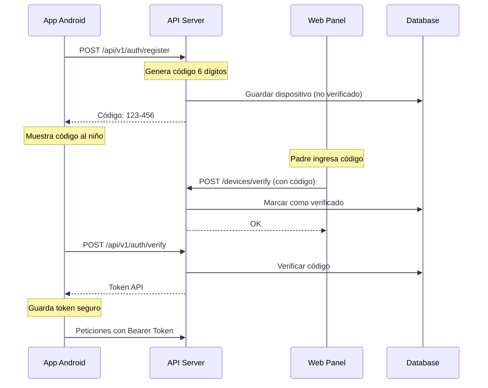

# Sistema de Autenticación de Dispositivos

## Resumen

Sistema de autenticación de dos pasos para dispositivos Android en la aplicación de Control Parental, implementado siguiendo Domain Driven Design (DDD) y Clean Architecture.

## Flujo de Autenticación



## Arquitectura - Servidor (Laravel)

### Estructura DDD

```
app/
├── Domain/
│   └── DeviceAuth/
│       ├── Actions/
│       │   ├── RegisterDeviceAction.php
│       │   └── VerifyDeviceAction.php
│       ├── DTOs/
│       │   ├── DeviceRegistrationData.php
│       │   └── DeviceVerificationData.php
│       ├── Events/
│       │   ├── DeviceRegistered.php
│       │   └── DeviceVerified.php
│       ├── Exceptions/
│       │   └── DeviceAuthException.php
│       ├── Repositories/
│       │   └── DeviceAuthRepositoryInterface.php
│       ├── Services/
│       │   ├── DeviceAuthService.php
│       │   └── VerificationCodeService.php
│       └── ValueObjects/
│           ├── DeviceToken.php
│           └── VerificationCode.php
├── Http/
│   ├── Controllers/
│   │   └── Api/V1/
│   │       └── AuthController.php
│   └── Middleware/
│       └── DeviceAuthentication.php
└── Infrastructure/
    └── Repositories/
        └── EloquentDeviceAuthRepository.php
```

### Endpoints API

#### 1. Registrar Dispositivo
```http
POST /api/v1/auth/register
Content-Type: application/json

{
    "device_id": "550e8400-e29b-41d4-a716-446655440000",
    "model": "Pixel 6",
    "android_version": "13",
    "app_version": "1.0.0",
    "manufacturer": "Google",
    "fingerprint": "google/pixel6/..."
}

Response 201:
{
    "success": true,
    "data": {
        "device_id": "550e8400-e29b-41d4-a716-446655440000",
        "verification_code": "123-456",
        "expires_in_minutes": 30,
        "message": "Ingrese este código en el panel de control parental"
    }
}
```

#### 2. Verificar Dispositivo
```http
POST /api/v1/auth/verify
Content-Type: application/json

{
    "device_id": "550e8400-e29b-41d4-a716-446655440000",
    "verification_code": "123456",
    "child_name": "Juan" // opcional
}

Response 200:
{
    "success": true,
    "data": {
        "device_id": "550e8400-e29b-41d4-a716-446655440000",
        "api_token": "eyJ0eXAiOiJKV1QiLCJhbGc...",
        "message": "Dispositivo verificado exitosamente"
    }
}
```

#### 3. Estado del Dispositivo
```http
GET /api/v1/auth/status
Authorization: Bearer {token}

Response 200:
{
    "success": true,
    "data": {
        "device_id": "550e8400-e29b-41d4-a716-446655440000",
        "model": "Pixel 6",
        "is_verified": true,
        "is_active": true,
        "is_blocked": false
    }
}
```

### Middleware de Autenticación

```php
// Uso en rutas
Route::middleware('device.auth')->group(function () {
    Route::post('/sync/apps', [SyncController::class, 'syncApps']);
    Route::post('/sync/events', [SyncController::class, 'syncEvents']);
});
```

## Arquitectura - Cliente (Android)

### Clean Architecture

```
app/src/main/java/com/ursolgleb/controlparental/
├── domain/
│   └── auth/
│       ├── model/
│       │   ├── DeviceRegistration.kt
│       │   ├── DeviceToken.kt
│       │   └── VerificationCode.kt
│       ├── repository/
│       │   └── DeviceAuthRepository.kt
│       └── usecase/
│           ├── RegisterDeviceUseCase.kt
│           └── VerifyDeviceUseCase.kt
├── data/
│   └── auth/
│       ├── local/
│       │   └── DeviceAuthLocalDataSource.kt
│       ├── remote/
│       │   ├── DeviceAuthApiService.kt
│       │   ├── DeviceAuthInterceptor.kt
│       │   └── dto/
│       │       ├── RegisterDeviceRequest.kt
│       │       └── VerifyDeviceResponse.kt
│       └── repository/
│           └── DeviceAuthRepositoryImpl.kt
├── presentation/
│   └── auth/
│       ├── DeviceAuthActivity.kt
│       └── DeviceAuthViewModel.kt
└── di/
    ├── AuthModule.kt
    └── NetworkModule.kt
```

### Almacenamiento Seguro

```kotlin
// Usando EncryptedSharedPreferences
private val encryptedPrefs = EncryptedSharedPreferences.create(
    context,
    "device_auth_prefs",
    masterKey,
    EncryptedSharedPreferences.PrefKeyEncryptionScheme.AES256_SIV,
    EncryptedSharedPreferences.PrefValueEncryptionScheme.AES256_GCM
)
```

### Interceptor de Autenticación

```kotlin
class DeviceAuthInterceptor : Interceptor {
    override fun intercept(chain: Interceptor.Chain): Response {
        val originalRequest = chain.request()
        
        // No agregar auth a rutas públicas
        if (isPublicPath(originalRequest)) {
            return chain.proceed(originalRequest)
        }
        
        val token = localDataSource.getApiToken()
        val request = if (token != null) {
            originalRequest.newBuilder()
                .header("Authorization", token.toAuthHeader())
                .header("X-Device-Token", token.token)
                .build()
        } else {
            originalRequest
        }
        
        return chain.proceed(request)
    }
}
```

## Seguridad

### 1. Token Management
- Tokens de 80 caracteres aleatorios
- Almacenados hasheados (SHA-256) en servidor
- Almacenados encriptados en cliente
- Sin expiración automática

### 2. Código de Verificación
- 6 dígitos numéricos
- Expira en 30 minutos
- Máximo 5 intentos fallidos
- Bloqueo temporal después de exceder intentos

### 3. Protección contra ataques
- Rate limiting en endpoints públicos
- Validación de UUID para device ID
- Verificación de firma HMAC opcional
- Logs de auditoría

## Migración de Base de Datos

```php
Schema::table('devices', function (Blueprint $table) {
    $table->string('android_version', 50)->nullable();
    $table->string('app_version', 50)->nullable();
    $table->string('manufacturer')->nullable();
    $table->string('device_fingerprint')->nullable();
    $table->string('api_token')->nullable()->index();
    $table->string('verification_code', 6)->nullable();
    $table->timestamp('verification_expires_at')->nullable();
    $table->boolean('is_verified')->default(false);
    $table->boolean('is_active')->default(true);
    $table->timestamp('verified_at')->nullable();
    $table->integer('failed_attempts')->default(0);
    $table->timestamp('blocked_until')->nullable();
});
```

## Configuración

### Servidor (Laravel)

```env
# .env
APP_URL=https://tu-servidor.com
DEVICE_TOKEN_LENGTH=80
VERIFICATION_CODE_EXPIRY=30
MAX_VERIFICATION_ATTEMPTS=5
```

### Cliente (Android)

```kotlin
// NetworkModule.kt
private const val BASE_URL = "https://tu-servidor.com/"

// build.gradle
buildConfigField("String", "API_BASE_URL", "\"${BASE_URL}\"")
```

## Testing

### Servidor
```bash
php artisan test --filter=DeviceAuth
```

### Cliente
```bash
./gradlew test
./gradlew connectedAndroidTest
```

## Troubleshooting

### Error: "Device not found"
- Verificar que el device_id sea UUID válido
- Verificar que el dispositivo esté registrado

### Error: "Invalid verification code"
- El código expira en 30 minutos
- Formato: 6 dígitos sin espacios/guiones
- Máximo 5 intentos

### Error: "Token expired"
- Los tokens no expiran automáticamente
- Verificar que no se haya revocado manualmente
- Verificar que el dispositivo esté activo

## Flujo de Usuario

1. **Primera vez:**
   - Niño abre la app
   - App detecta que no está registrada
   - Muestra botón "Registrar Dispositivo"
   - Al presionar, genera código 123-456
   - Niño muestra código a padre

2. **Padre verifica:**
   - Ingresa a panel web
   - Va a "Dispositivos" → "Agregar"
   - Ingresa código del niño
   - Opcionalmente asigna nombre

3. **Niño completa:**
   - Ingresa el mismo código en la app
   - Opcionalmente ingresa su nombre
   - App recibe token y guarda
   - Navega a pantalla principal

4. **Uso posterior:**
   - App usa token guardado
   - No requiere login
   - Token persiste hasta reset 